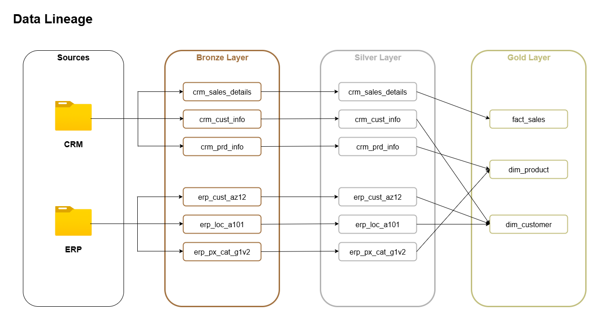

# 📊 Data Warehouse & Analytics Project

Welcome to the **Data Warehouse & Analytics Project** repository 🚀  
This portfolio project showcases the full journey of creating a modern data warehouse and building analytical solutions on top of it. From integrating raw data sources to generating actionable insights, the aim is to demonstrate industry-standard practices in **data engineering** and **data analytics**.

---

## 🔧 Project Overview

### Data Engineering: Building the Warehouse
The first phase focuses on consolidating data using SQL Server to establish a reliable warehouse environment. The goals are:

- **Data Ingestion**: Import datasets from two systems (ERP and CRM) delivered in CSV format.  
- **Data Quality**: Cleanse, standardise and resolve inconsistencies before further analysis.  
- **Integration**: Merge both sources into a single, analysis-friendly model optimised for querying.  
- **Scope**: Work with the latest available dataset (no requirement for historisation at this stage).  
- **Documentation**: Provide clear, well-structured documentation to support both business and analytics users.  

### Data Analytics: BI & Reporting
Once the warehouse is built, SQL-driven analytics are developed to provide deeper insights into key areas:

- **Customer Behaviour** – Understanding how customers interact and engage.  
- **Product Performance** – Assessing product sales, strengths, and opportunities.  
- **Sales Trends** – Identifying changes and emerging patterns over time.    

---

## 🏛 Data Architecture

This section describes the overall architecture of the data warehouse, illustrating the flow from raw source systems through staging and Silver layers to the Gold layer.  

**Illustrations / Diagrams:**  

---

## 🔄 Data Lineage

The data lineage captures the journey of each dataset, highlighting how raw fields are transformed, cleansed, and enriched across layers before reaching the Gold layer.  

**Illustrations / Diagrams:**  

---

## ⭐ Final Data Mart Schema

The Gold layer implements a star schema for analytics, consisting of two dimension views (`dim_customer` and `dim_product`) and one fact view (`fact_sales`). All columns are enriched with user-friendly names, standardised formats, and calculated fields where needed.  

**Illustrations / Diagrams:**  

---

## 📖 Licence

This project is released under the **MIT Licence**.  
That means you’re free to use, modify, and share the code as you wish.

---

## 👤 About Me

Hello! I’m **Aronas Zilys**, a **Data Analytics Consultant** who enjoys working with data and continuously learning new skills. My focus is on transforming raw data into valuable insights that help drive positive action and better decision-making. I take pride in building solutions that make data more meaningful, accessible, and impactful for organisations.

